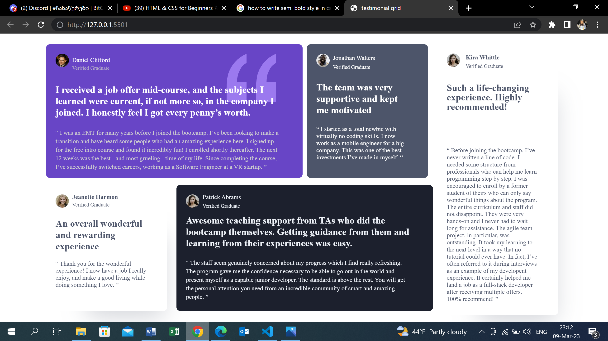

# Frontend Mentor - Testimonials grid section

This is a solution to the [testimonials grid section challenge on Frontend Mentor](https://www.frontendmentor.io/challenges/testimonials-grid-section-Nnw6J7Un7)

### Screenshot

### Links

- Live Site URL: [Add live site URL here](http://127.0.0.1:5501)

## My process

### Built with

- Semantic HTML5 markup
- CSS custom properties
- CSS Grid
-

### What I learned

Some HTML and
Some CSS
